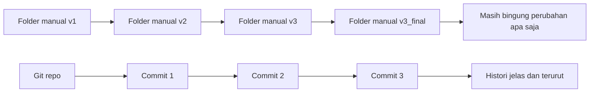
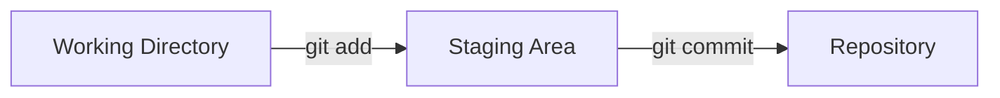
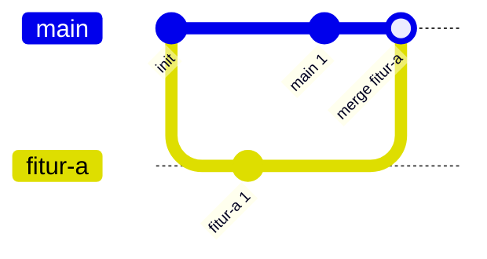
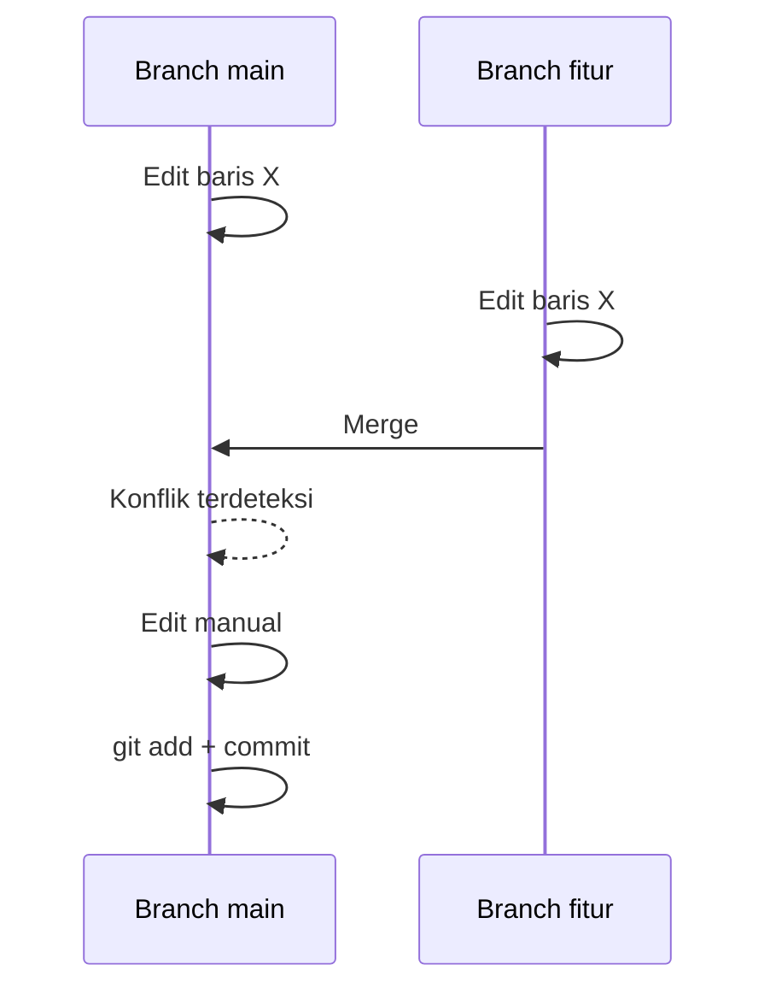
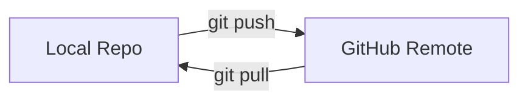
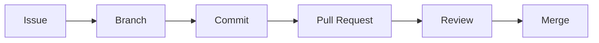
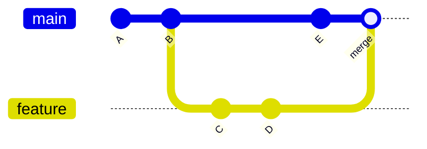
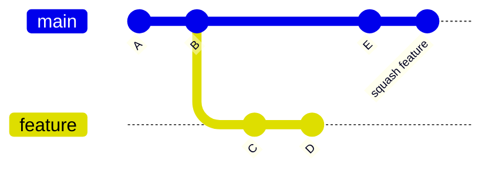
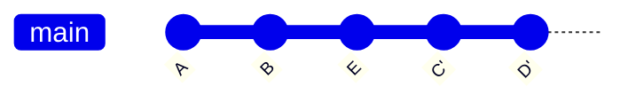

# Buku Praktis: Git dan GitHub untuk Pemula

## Tentang Buku Ini
Buku ini adalah modul pelatihan langkah demi langkah untuk pemula total. Setiap bab dibangun secara bertahap, dari nol hingga mampu bekerja dengan Git dan GitHub secara mandiri untuk proyek kecil. Materi disusun modular, sehingga bisa dipakai sebagai buku ajar, pegangan kelas, atau belajar mandiri.

## Tujuan Akhir
Setelah menyelesaikan buku ini, pembaca mampu:
- Menjelaskan konsep version control dengan kata-kata sendiri.
- Membuat dan mengelola repository Git lokal.
- Melakukan commit dengan pesan yang baik.
- Membuat branch, menggabungkan perubahan, dan menyelesaikan konflik sederhana.
- Menghubungkan repository lokal ke GitHub.
- Menggunakan issues dan pull request untuk kolaborasi dasar.
- Memahami perbedaan merge, squash, dan rebase secara konseptual.
- Menulis dokumentasi sederhana dengan Markdown.

## Cara Menggunakan Buku
- Ikuti urutan bab karena setiap bab saling terkait.
- Selesaikan latihan di akhir bab sebelum lanjut.
- Jika belajar mandiri, siapkan waktu 2-3 jam untuk menyelesaikan semua bab utama.

## Prasyarat Minimum
- Laptop/PC.
- Koneksi internet.
- Git sudah terinstal.
- Akun GitHub.
- Editor kode seperti VS Code.

---

# Bab 1. Mengapa Version Control Itu Penting

## 1.1 Masalah Umum Tanpa Version Control
Bayangkan Anda membuat tugas kuliah atau project kantor. Anda membuat folder seperti ini:
- `project_final`
- `project_final_fix`
- `project_final_revisi`
- `project_final_revisi_baru`

Masalahnya:
- Sulit tahu perubahan apa yang terjadi di tiap versi.
- Jika ada bug, Anda tidak tahu perubahan mana yang menyebabkan bug.
- Kolaborasi dengan teman jadi rumit.

## 1.2 Definisi Version Control
Version control adalah sistem untuk mencatat perubahan file dari waktu ke waktu, sehingga Anda bisa:
- Melihat histori perubahan.
- Kembali ke versi sebelumnya.
- Berkolaborasi tanpa saling menimpa file.

## 1.3 Studi Kasus Mini
Kasus: Dua orang mengedit file laporan yang sama.
- Tanpa version control: file saling overwrite, hasil bercampur.
- Dengan version control: tiap perubahan tercatat, konflik bisa diselesaikan.

## 1.4 Ilustrasi: Perbandingan Manual vs Version Control


## Ringkasan Bab 1
- Version control menyelamatkan waktu dan mengurangi risiko.
- Riwayat perubahan adalah dokumentasi terbaik.

## Latihan Bab 1
1. Tuliskan 3 masalah yang pernah Anda alami saat menyimpan banyak versi file.
2. Tuliskan 2 manfaat version control menurut Anda.

---

# Bab 2. Mengenal Git

## 2.1 Apa Itu Git
Git adalah sistem version control terdistribusi (DVCS). Artinya, setiap orang memiliki salinan penuh repository dan histori di komputer lokal.

## 2.2 Alternatif Git
Beberapa alternatif Git:
- Subversion (SVN)
- Mercurial
- Perforce

Git adalah pilihan paling umum untuk proyek modern.

## 2.3 Git sebagai Dokumentasi Proyek
Setiap commit berfungsi seperti catatan perubahan.
- Commit kecil dan jelas membuat histori proyek mudah dipahami.
- Histori commit bisa dianggap sebagai dokumentasi kronologis.

## Studi Kasus Mini
Kasus: Anda menambahkan fitur login.
- Commit 1: `add login page layout`
- Commit 2: `add login validation`
- Commit 3: `fix error message formatting`

Dengan histori ini, orang lain dapat membaca perkembangan fitur secara jelas.

## Ringkasan Bab 2
- Git adalah DVCS yang paling banyak digunakan.
- Commit adalah unit dokumentasi perubahan.

## Latihan Bab 2
1. Jelaskan dengan kata-kata sendiri apa itu Git.
2. Jelaskan perbedaan Git dengan folder versi manual.

---

# Bab 3. Menyiapkan Lingkungan Kerja

## 3.1 Instalasi Git
- Pastikan Git terinstal.
- Cek dengan perintah: `git --version`.

## 3.2 Konfigurasi Dasar
Jalankan perintah berikut sekali saja:
1. `git config --global user.name "Nama Anda"`
2. `git config --global user.email "email@anda.com"`

## 3.3 Editor Kode
Gunakan VS Code atau editor lain yang Anda nyaman.

## Ringkasan Bab 3
- Git perlu konfigurasi nama dan email.
- Editor membantu melihat perubahan dengan mudah.

## Latihan Bab 3
1. Jalankan `git --version` dan catat versinya.
2. Pastikan konfigurasi nama dan email terset.

---

# Bab 4. Repository Lokal Pertama

## 4.1 Membuat Repository
Langkah-langkah:
1. Buat folder baru, misal `belajar-git`.
2. Masuk ke folder tersebut.
3. Jalankan `git init`.

## 4.2 Membuat File dan Commit Pertama
1. Buat file `README.md`.
2. Isi dengan teks sederhana, misal: `# Belajar Git`.
3. Jalankan `git status` untuk melihat perubahan.
4. Jalankan `git add README.md`.
5. Jalankan `git commit -m "add initial README"`.

## 4.3 Memahami `git status`
- Menunjukkan file yang belum disimpan ke commit.
- Memberi petunjuk langkah berikutnya.

## 4.4 Ilustrasi: Alur File di Git


## Studi Kasus Mini
Kasus: Anda menambahkan file `notes.txt` tetapi lupa `git add`.
- `git status` akan menunjukkan file tersebut sebagai untracked.

## Ringkasan Bab 4
- `git init` membuat repo.
- `git add` menaruh perubahan ke staging.
- `git commit` menyimpan perubahan.

## Latihan Bab 4
1. Buat repo baru dengan `git init`.
2. Buat 2 commit pada file berbeda.
3. Jalankan `git status` setelah tiap langkah.

---

# Bab 5. Melihat Histori dengan Git Log

## 5.1 Perintah `git log`
Perintah: `git log`.
Fungsi: menampilkan histori commit.

## 5.2 Membaca Informasi Log
Setiap commit menampilkan:
- Hash commit.
- Nama penulis.
- Tanggal.
- Pesan commit.

## 5.3 Gunakan Log untuk Audit
Contoh penggunaan:
- Mencari kapan fitur ditambahkan.
- Menemukan perubahan terakhir sebelum bug muncul.

## Latihan Bab 5
1. Jalankan `git log`.
2. Catat 2 commit terakhir beserta pesannya.

---

# Bab 6. Branching untuk Fitur Terpisah

## 6.1 Apa Itu Branch
Branch adalah jalur pengembangan terpisah dari `main`.

## 6.2 Membuat dan Berpindah Branch
Langkah:
1. `git branch fitur-a`
2. `git switch fitur-a`

## 6.3 Menggabungkan Branch
Kembali ke `main` lalu gabungkan:
1. `git switch main`
2. `git merge fitur-a`

## 6.4 Ilustrasi: Branching Sederhana


## Studi Kasus Mini
Kasus: Anda menambahkan fitur baru tanpa mengganggu versi stabil.
- Branch `feature-login` dikerjakan terpisah.
- Setelah selesai, merge ke `main`.

## Ringkasan Bab 6
- Branch membantu memisahkan pekerjaan.
- Merge menyatukan perubahan.

## Latihan Bab 6
1. Buat branch baru.
2. Tambahkan 1 file baru di branch.
3. Merge ke `main`.

---

# Bab 7. Konflik dan Cara Menyelesaikannya

## 7.1 Apa Itu Konflik
Konflik terjadi ketika dua perubahan menyentuh baris yang sama.

## 7.2 Cara Memunculkan Konflik (Latihan)
Langkah:
1. Di `main`, edit baris pertama `README.md`.
2. Commit perubahan.
3. Pindah ke branch lain dan edit baris yang sama.
4. Commit perubahan.
5. Coba merge ke `main`.

## 7.3 Menyelesaikan Konflik
- Buka file konflik.
- Pilih perubahan yang benar.
- Simpan file.
- Jalankan `git add` dan `git commit`.

## 7.4 Ilustrasi: Konflik dan Resolusi


## Ringkasan Bab 7
- Konflik normal dalam kolaborasi.
- Kuncinya adalah memahami konteks perubahan.

## Latihan Bab 7
1. Buat konflik sederhana.
2. Selesaikan konflik dan commit hasilnya.

---

# Bab 8. Git Blame untuk Melacak Perubahan

## 8.1 Fungsi `git blame`
Perintah `git blame` menunjukkan siapa yang terakhir mengubah setiap baris.

## 8.2 Contoh Penggunaan
- Mencari siapa yang menambahkan baris yang menimbulkan bug.
- Menghubungi orang tersebut untuk konteks.

## Latihan Bab 8
1. Jalankan `git blame README.md`.
2. Identifikasi commit terakhir yang mengubah baris tertentu.

---

# Bab 9. Git di Terminal vs GUI

## 9.1 Terminal
Kelebihan:
- Kontrol penuh.
- Cocok untuk scripting.

## 9.2 GUI
Kelebihan:
- Visual diff lebih jelas.
- Mudah untuk pemula.

Contoh GUI:
- GitHub Desktop.
- VS Code Source Control.

## Latihan Bab 9
1. Lakukan 1 commit di terminal.
2. Lihat hasilnya di GUI.

---

# Bab 10. Perkenalan GitHub

## 10.1 Git vs GitHub
- Git adalah tool.
- GitHub adalah platform hosting Git.

## 10.2 Alternatif GitHub
- GitLab.
- Bitbucket.
- Azure Repos.

## 10.3 Fitur Dasar GitHub
- Repository.
- Issues.
- Pull request.
- Review dan diskusi.

## Ringkasan Bab 10
GitHub memudahkan kolaborasi dan berbagi kode.

---

# Bab 11. Local vs Remote

## 11.1 Konsep Local dan Remote
- Local: repository di komputer Anda.
- Remote: repository di server (GitHub).

## 11.2 Menambah Remote
1. Buat repo kosong di GitHub.
2. Jalankan `git remote add origin <URL>`.
3. Push dengan `git push -u origin main`.

## 11.3 Ilustrasi: Local dan Remote


## 11.4 Git Credentials dan Autentikasi GitHub
Saat Git berbicara dengan GitHub (push/pull), Git perlu **autentikasi**. Autentikasi ini tidak “tersimpan di Git”, melainkan dikelola oleh sistem kredensial di komputer Anda.

### Opsi Autentikasi Utama
- **HTTPS + Personal Access Token (PAT)**: lebih mudah untuk pemula.
- **SSH Key**: lebih praktis untuk penggunaan jangka panjang.

### A. HTTPS + PAT (Pemula)
Konsep:
- GitHub **tidak menerima password akun** untuk operasi Git via HTTPS.
- Anda harus memakai **PAT** sebagai pengganti password.

Langkah ringkas:
1. Buat PAT di GitHub (Settings → Developer settings → Personal access tokens).
2. Saat Git meminta username dan password:
   - Username: username GitHub Anda.
   - Password: PAT yang baru dibuat.
3. Credential manager akan menyimpan token agar tidak perlu input ulang.

Catatan:
- Di Windows, Git biasanya memakai **Git Credential Manager** untuk menyimpan token.

### B. SSH Key (Lebih Praktis)
Konsep:
- Anda membuat kunci SSH di komputer, lalu mendaftarkan **public key** ke GitHub.
- Setelah itu push/pull bisa dilakukan tanpa memasukkan token.

Langkah ringkas:
1. Buat key: `ssh-keygen -t ed25519 -C "email@anda.com"`.
2. Tambahkan **public key** ke GitHub (Settings → SSH and GPG keys).
3. Uji koneksi: `ssh -T git@github.com`.
4. Pastikan remote memakai SSH:
   - Contoh format: `git@github.com:username/nama-repo.git`
   - Ganti remote: `git remote set-url origin git@github.com:username/nama-repo.git`

### Bagaimana Git Menghubungkan Kredensial ke Akun GitHub
- Git melihat URL remote repo.
- Jika URL HTTPS, Git meminta kredensial (username + PAT).
- Jika URL SSH, Git memakai private key di komputer.
- GitHub memverifikasi dan menghubungkan ke akun berdasarkan token atau public key.

## Latihan Bab 11 (Opsional)
1. Cek remote Anda: `git remote -v`.
2. Tentukan apakah Anda memakai HTTPS atau SSH.
3. Jika HTTPS, pastikan token tersimpan dengan benar.
4. Jika SSH, jalankan `ssh -T git@github.com` untuk memastikan koneksi.

## Studi Kasus Mini
Kasus: Anda bekerja di dua laptop.
- Push dari laptop 1.
- Pull di laptop 2.

## Latihan Bab 11
1. Buat repo kosong di GitHub.
2. Hubungkan repo lokal ke GitHub.
3. Push perubahan.

---

# Bab 12. GitHub Issues

## 12.1 Apa Itu Issues
Issues adalah daftar tugas, bug, atau diskusi.

## 12.2 Contoh Penggunaan
- Bug: "Login gagal saat password kosong".
- Task: "Buat halaman profil".

## 12.3 Langkah Dasar
1. Buat issue baru.
2. Isi judul dan deskripsi.
3. Tambahkan label dan assignee jika perlu.

## Latihan Bab 12
1. Buat 1 issue di repo GitHub Anda.
2. Tambahkan label sederhana.

---

# Bab 13. Pull Request

## 13.1 Apa Itu Pull Request
PR adalah proposal perubahan dari branch ke branch lain.

## 13.2 Alur Dasar
1. Buat branch.
2. Commit perubahan.
3. Push branch.
4. Buat PR di GitHub.

## 13.3 Review dan Merge
- Reviewer memberi komentar.
- Setelah disetujui, perubahan di-merge.

## 13.4 Ilustrasi: Alur Pull Request


## Latihan Bab 13
1. Buat branch baru.
2. Lakukan perubahan kecil.
3. Buka PR dan merge.

---

# Bab 14. Forking

## 14.1 Apa Itu Fork
Fork adalah salinan repo ke akun Anda.

## 14.2 Kapan Menggunakan Fork
- Kontribusi ke proyek open source.
- Anda tidak punya akses langsung ke repo utama.

## Latihan Bab 14
1. Fork repo publik.
2. Buat perubahan kecil.
3. Buat PR ke repo asal.

---

# Bab 15. Merge, Squash, dan Rebase (Konsep)

## 15.1 Merge Commit
- Menjaga histori lengkap.
- Cocok jika ingin melihat semua commit.

## 15.2 Squash Merge
- Menggabungkan banyak commit menjadi satu.
- Cocok untuk histori yang ringkas.

## 15.3 Rebase
- Menyusun ulang commit agar histori linear.
- Sering digunakan sebelum merge.

## Studi Kasus Mini
Kasus: Branch Anda punya 8 commit kecil.
- Jika ingin histori bersih, gunakan squash.
- Jika ingin riwayat detail, gunakan merge commit.

## 15.4 Ilustrasi: Merge vs Squash vs Rebase

### A. Merge Commit (histori bercabang tetap terlihat)


### B. Squash Merge (banyak commit jadi satu)


### C. Rebase Lalu Merge (histori jadi linear)


---

# Bab 16. GitHub Actions (Intro)

## 16.1 Konsep Dasar
GitHub Actions adalah automasi workflow seperti build dan test.

## 16.2 Contoh Sederhana
- Saat ada push, jalankan build.
- Workflow ditulis dalam file YAML.

## Ringkasan Bab 16
Actions membantu otomatisasi langkah berulang.

---

# Bab 17. Markdown untuk Dokumentasi

## 17.1 Mengapa Markdown
Markdown adalah format teks sederhana yang mudah dibaca dan ditulis.

## 17.2 Syntax Dasar
- Heading dengan `#`.
- List dengan `-`.
- Code block dengan triple backtick.
- Link dengan `[teks](url)`.

## 17.3 Contoh README
```
# Proyek Belajar Git

## Tujuan
Belajar Git dari dasar.

## Cara Menjalankan
- Clone repo.
- Buka file README.
```

## Latihan Bab 17
1. Buat README sederhana untuk repo Anda.
2. Gunakan minimal 2 heading dan 1 code block.

---

# Bab 18. Studi Kasus Lengkap: Proyek Mini

## 18.1 Deskripsi Proyek
Anda membuat proyek mini: "Website Profil".

## 18.2 Langkah Lengkap
1. Buat repo lokal.
2. Buat file `index.html`.
3. Commit awal.
4. Buat branch `feature-bio`.
5. Tambahkan bagian bio.
6. Commit perubahan.
7. Merge ke `main`.
8. Push ke GitHub.
9. Buat issue: "Tambah kontak".
10. Buat branch `feature-contact`.
11. Tambah bagian kontak.
12. Commit dan push.
13. Buat PR dan merge.

## 18.3 Hasil Akhir
- Repo berisi histori commit jelas.
- Ada issue dan PR di GitHub.

---

# Bab 19. Checklist Akhir

## 19.1 Checklist Kompetensi
1. Saya memahami konsep version control.
2. Saya bisa membuat repo dan commit.
3. Saya bisa membuat branch dan merge.
4. Saya pernah menyelesaikan konflik.
5. Saya bisa push ke GitHub.
6. Saya bisa membuat issue dan PR.
7. Saya memahami konsep merge, squash, dan rebase.
8. Saya bisa menulis README dengan Markdown.

## 19.2 Jika Masih Kesulitan
- Ulangi bab yang terkait.
- Praktikkan kembali latihan.

---

# Referensi Resmi
- https://github.com/git-guides
- https://learn.microsoft.com/en-us/training/paths/github-foundations/
- https://learn.microsoft.com/en-us/training/paths/github-foundations-2/
