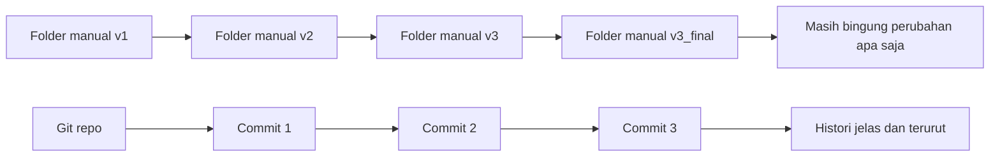
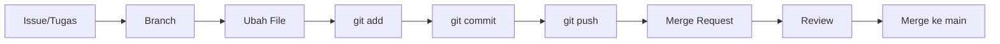
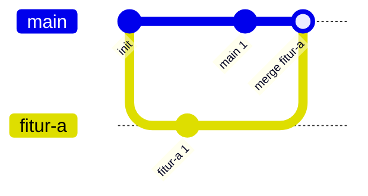
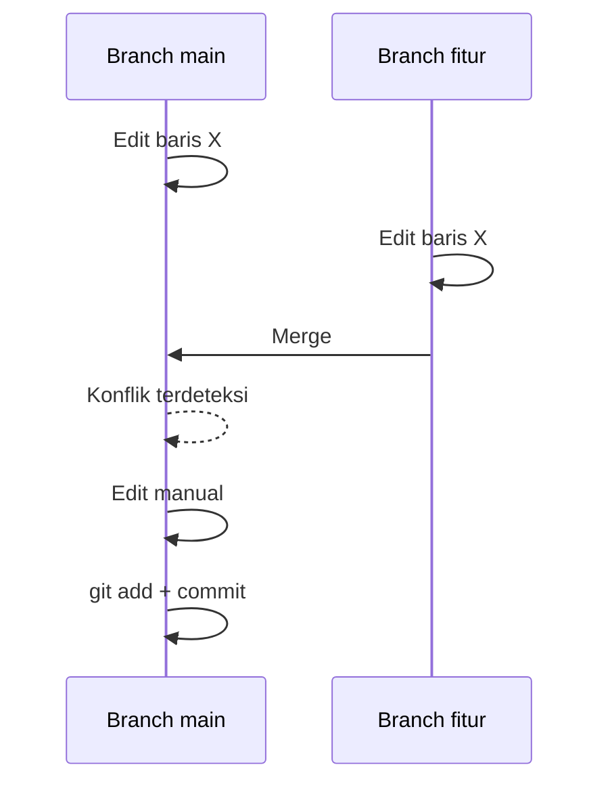
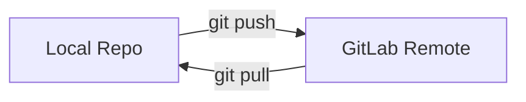
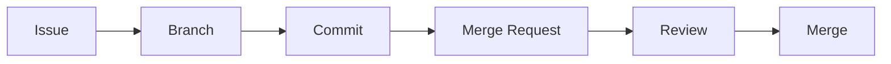
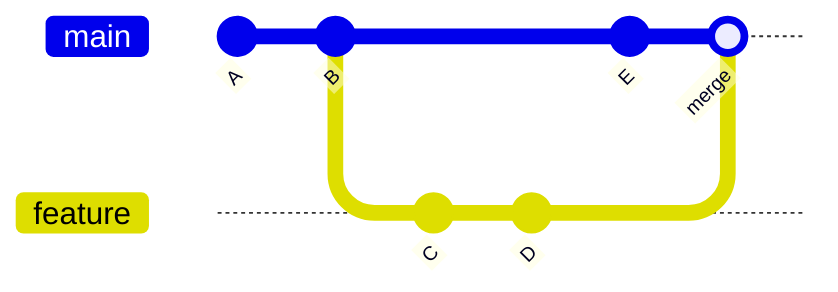
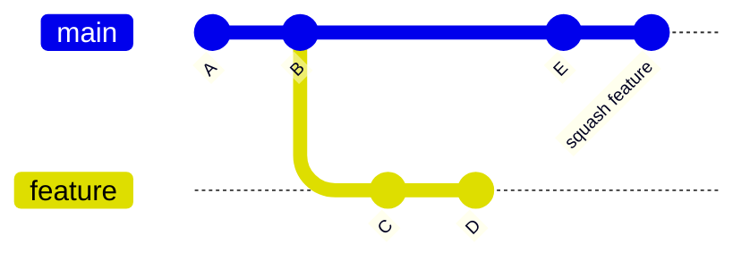
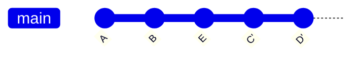

# Buku Praktis: Git dan GitLab untuk Pemula

## Tentang Buku Ini
Buku ini adalah modul pelatihan langkah demi langkah untuk pemula total. Setiap bab dibangun secara bertahap, dari nol hingga mampu bekerja dengan Git dan GitLab secara mandiri untuk proyek kecil. Materi disusun modular, sehingga bisa dipakai sebagai buku ajar, pegangan kelas, atau belajar mandiri.

## Tujuan Akhir
Setelah menyelesaikan buku ini, pembaca mampu:
- Menjelaskan konsep version control dengan kata-kata sendiri.
- Membuat dan mengelola repository Git lokal.
- Melakukan commit dengan pesan yang baik.
- Membuat branch, menggabungkan perubahan, dan menyelesaikan konflik sederhana.
- Menghubungkan repository lokal ke GitLab.
- Menggunakan issues dan pull request untuk kolaborasi dasar.
- Memahami perbedaan merge, squash, dan rebase secara konseptual.
- Menulis dokumentasi sederhana dengan Markdown.

## Cara Menggunakan Buku
- Ikuti urutan bab karena setiap bab saling terkait.
- Selesaikan latihan di akhir bab sebelum lanjut.
- Jika belajar mandiri, siapkan waktu 2-3 jam untuk menyelesaikan semua bab utama.

## Prasyarat Minimum
- Laptop/PC.
- Koneksi internet.
- Git sudah terinstal.
- Akun GitLab.
- Editor kode seperti VS Code.

---

# Bab 1. Mengapa Version Control Itu Penting

## 1.1 Masalah Umum Tanpa Version Control
Bayangkan Anda membuat tugas kuliah atau project kantor. Anda membuat folder seperti ini:
- `project_final`
- `project_final_fix`
- `project_final_revisi`
- `project_final_revisi_baru`

Masalahnya:
- Sulit tahu perubahan apa yang terjadi di tiap versi.
- Jika ada bug, Anda tidak tahu perubahan mana yang menyebabkan bug.
- Kolaborasi dengan teman jadi rumit.

## 1.2 Definisi Version Control
Version control adalah sistem untuk mencatat perubahan file dari waktu ke waktu, sehingga Anda bisa:
- Melihat histori perubahan.
- Kembali ke versi sebelumnya.
- Berkolaborasi tanpa saling menimpa file.

## 1.3 Studi Kasus Mini
Kasus: Dua orang mengedit file laporan yang sama.
- Tanpa version control: file saling overwrite, hasil bercampur.
- Dengan version control: tiap perubahan tercatat, konflik bisa diselesaikan.

## 1.4 Ilustrasi: Perbandingan Manual vs Version Control


## Ringkasan Bab 1
- Version control menyelamatkan waktu dan mengurangi risiko.
- Riwayat perubahan adalah dokumentasi terbaik.

## Latihan Bab 1
1. Tuliskan 3 masalah yang pernah Anda alami saat menyimpan banyak versi file.
2. Tuliskan 2 manfaat version control menurut Anda.

---

# Bab 2. Mengenal Git

## 2.1 Apa Itu Git
Git adalah sistem version control terdistribusi (DVCS). Artinya, setiap orang memiliki salinan penuh repository dan histori di komputer lokal.

## 2.2 Alternatif Git
Beberapa alternatif Git:
- Subversion (SVN)
- Mercurial
- Perforce

Git adalah pilihan paling umum untuk proyek modern.

## 2.3 Git sebagai Dokumentasi Proyek
Setiap commit berfungsi seperti catatan perubahan.
- Commit kecil dan jelas membuat histori proyek mudah dipahami.
- Histori commit bisa dianggap sebagai dokumentasi kronologis.

## Studi Kasus Mini
Kasus: Anda menambahkan fitur login.
- Commit 1: `add login page layout`
- Commit 2: `add login validation`
- Commit 3: `fix error message formatting`

Dengan histori ini, orang lain dapat membaca perkembangan fitur secara jelas.

## 2.4 Konsep Dasar Git dan Terminologi Penting
Bagian ini merangkum istilah paling umum di Git. Pahami dulu konsepnya, baru lanjut ke praktik.

### Repository (Repo)
Tempat Git menyimpan seluruh histori perubahan dan konfigurasi proyek. Saat Anda menjalankan `git init`, Git membuat folder tersembunyi `.git` di dalam folder proyek. Folder `.git` adalah “otak” dari repo.

Contoh cerita: Rina membuat folder `belajar-git` lalu menjalankan `git init`. Sejak saat itu folder tersebut menjadi sebuah repo karena Git menambahkan `.git`.

### Working Directory
Folder kerja tempat Anda membuat dan mengedit file. Ini adalah keadaan file terbaru yang Anda lihat di editor.

Contoh cerita: Dito membuka `README.md` di VS Code dan mengetik kalimat baru. Perubahan itu ada di working directory sampai dia memilih untuk menyimpannya ke staging.

### Staging Area (Index)
Tempat “penampungan sementara” sebelum commit. Anda memilih perubahan apa yang akan disimpan dengan `git add`. Ini memungkinkan Anda memilih file tertentu saja yang masuk ke commit.

Contoh cerita: Sinta mengubah `README.md` dan `notes.txt`. Ia hanya ingin menyimpan `README.md`, jadi ia menjalankan `git add README.md` dan hanya file itu yang masuk staging.

### Commit
Snapshot perubahan yang disimpan ke repo. Setiap commit punya:
- ID unik (hash).
- Nama penulis.
- Waktu commit.
- Pesan commit yang menjelaskan tujuan perubahan.

**Contoh keluaran `git log` sederhana:**
```
commit 7c9a2f1e6b1c1d8a6a0d6c1b4f5a7b9c1a2b3c4d
Author: Budi <budi@email.com>
Date:   Wed Feb 25 10:30:12 2026 +0700

    add login page layout
```

**Contoh pesan commit yang baik:**
- `add login page layout`
- `fix null check on user profile`
- `update README with setup steps`

Contoh cerita: Setelah halaman login selesai, Budi membuat commit dengan pesan `add login page layout` agar tim mudah memahami perubahan yang dilakukan.

### Branch
Jalur pengembangan terpisah. Branch memudahkan Anda mengerjakan fitur tanpa mengganggu `main`.
Contoh: `feature-login`, `fix-bug-123`.

Contoh cerita: Tim membuat branch `feature-login` untuk menambahkan halaman login tanpa mengubah versi stabil di `main`.

### Merge
Proses menggabungkan perubahan dari branch lain ke branch aktif. Biasanya setelah fitur selesai, branch digabung ke `main`.

Contoh cerita: Setelah `feature-login` selesai dan diuji, tim melakukan merge agar fitur login resmi masuk ke `main`.

### Remote
Repo jarak jauh (misalnya di GitLab) yang menjadi sumber kolaborasi. Anda bisa punya lebih dari satu remote, tapi umumnya memakai `origin`.

Contoh cerita: Repo lokal Sari terhubung ke GitLab. GitLab itu adalah remote tempat timnya berbagi perubahan.

### Origin
Nama default untuk remote utama. Saat Anda clone repo, Git otomatis membuat remote bernama `origin`.

Contoh cerita: Setelah clone repo tim, Tono menjalankan `git remote -v` dan melihat nama `origin` yang menunjuk ke GitLab perusahaan.

### HEAD
Penanda commit/branch yang sedang aktif. Saat Anda berpindah branch, `HEAD` ikut berpindah.

Contoh cerita: Ketika Nia pindah dari `main` ke `feature-login`, `HEAD` ikut berpindah dan menunjuk ke branch `feature-login`.

### Main (atau Master)
Branch utama proyek. Banyak proyek modern memakai nama `main`.

Contoh cerita: Versi yang selalu stabil berada di branch `main`, dan tim hanya merge fitur yang sudah lolos review.

### Clone
Menduplikasi repo dari remote ke lokal, termasuk histori commit.
Perintah: `git clone <URL>`.

Contoh cerita: Andi baru bergabung ke tim, ia menjalankan `git clone` agar mendapatkan seluruh histori proyek di laptopnya.

### Pull dan Push
- `git pull`: mengambil perubahan dari remote dan menggabungkannya ke lokal.
- `git push`: mengirim commit lokal ke remote.

Contoh cerita: Pagi hari, Rudi menjalankan `git pull` untuk mengambil update tim. Setelah selesai bekerja, ia `git push` agar orang lain bisa melihat hasilnya.

### Fetch
Mengambil perubahan dari remote tanpa menggabungkan ke branch lokal. Berguna jika Anda ingin melihat perubahan dulu.

Contoh cerita: Lala ingin mengecek perubahan terbaru tanpa mengganggu pekerjaannya, jadi ia memakai `git fetch` lalu meninjau perbedaannya.

### Switch/Checkout
Berpindah branch.
- `git switch nama-branch` (disarankan).
- `git checkout nama-branch` (lebih lama, tetapi masih umum).

Contoh cerita: Damar sedang memperbaiki bug, lalu ia menjalankan `git switch fix-bug-123` untuk fokus di branch tersebut.

### Diff
Melihat perbedaan antara dua versi file atau antara working directory dan commit terakhir.
Perintah: `git diff`.

Contoh cerita: Sebelum commit, Eka menjalankan `git diff` untuk memastikan hanya baris yang ia maksud yang berubah.

### Tag
Penanda pada commit tertentu, biasanya untuk rilis versi.
Contoh: `v1.0.0`.

Contoh cerita: Setelah rilis pertama selesai, tim menambahkan tag `v1.0.0` pada commit rilis agar mudah ditemukan di masa depan.

### .gitignore
File konfigurasi untuk memberitahu Git agar mengabaikan file tertentu (misal: file build, cache, atau kredensial lokal).

Contoh cerita: Folder `node_modules` terlalu besar dan tidak perlu di-commit, jadi tim menuliskannya di `.gitignore`.

**Kenapa penting:** Tanpa `.gitignore`, repo bisa penuh file sementara yang tidak relevan, membuat commit berat dan sulit dibaca.

**Contoh isi `.gitignore` sederhana:**
```
node_modules/
dist/
.env
*.log
```

**Kapan dibuat:** Idealnya di awal proyek, sebelum banyak file sementara tercatat.

### Conflict
Terjadi saat dua perubahan menyentuh baris yang sama dan Git tidak bisa memutuskan mana yang benar. Konflik harus diselesaikan manual.

Contoh cerita: A mengedit `laporan.md` pada baris 10-16 untuk menambah paragraf. Pada waktu yang hampir sama, C mengedit `laporan.md` pada baris 12-14 untuk memperbaiki kalimat. Saat merge, Git mendeteksi konflik karena perubahan terjadi di rentang baris yang saling tumpang tindih.

## 2.5 Git Workflow Dasar dan Contoh
Workflow adalah urutan kerja yang konsisten agar perubahan teratur, mudah direview, dan aman untuk kolaborasi.

### Alur Umum (Versi Sederhana)
1. Buat atau pilih issue (tugas/bug).
2. Buat branch untuk tugas tersebut.
3. Kerjakan perubahan di working directory.
4. `git add` untuk memilih perubahan yang akan disimpan.
5. `git commit` dengan pesan yang jelas.
6. `git push` ke remote.
7. (Jika memakai GitLab) buka merge request.
8. Review, perbaiki jika perlu, lalu merge ke `main`.

### Ilustrasi Workflow


### Contoh Cerita Workflow
Kasus: Tim ingin menambahkan fitur “Profil Pengguna”.
1. Tim membuat issue: “Tambah halaman profil pengguna”.
2. Rina membuat branch `feature-profile`.
3. Rina menambah file `profile.html` dan mengedit `style.css`.
4. Rina memilih perubahan yang benar dengan `git add profile.html style.css`.
5. Rina commit dengan pesan `add user profile page`.
6. Rina push ke GitLab: `git push -u origin feature-profile`.
7. Rina membuka merge request dan meminta review.
8. Setelah disetujui, branch di-merge ke `main`.

### Kenapa Workflow Penting
- Mencegah perubahan besar yang sulit dilacak.
- Memudahkan review karena perubahan fokus per fitur.
- Mengurangi konflik di branch utama.

## 2.6 Top 10 Perintah Git yang Paling Sering Dipakai
Bagian ini merangkum perintah inti untuk pemula dan tim kecil.

1. `git init` membuat repo baru di folder saat ini.
2. `git clone <URL>` menyalin repo dari remote ke lokal.
3. `git status` melihat status perubahan file.
4. `git add <file>` memasukkan perubahan ke staging.
5. `git commit -m "pesan"` menyimpan snapshot perubahan.
6. `git log` menampilkan histori commit.
7. `git branch` membuat atau melihat daftar branch.
8. `git switch <branch>` berpindah ke branch tertentu.
9. `git checkout <branch>` cara lama yang masih sering ditemui untuk berpindah branch.
10. `git merge <branch>` menggabungkan branch ke branch aktif.
11. `git pull` mengambil perubahan dari remote.
12. `git push` mengirim commit lokal ke remote.

Contoh alur singkat:
```
git status
git add README.md
git commit -m "update README"
git push
```

## Ringkasan Bab 2
- Git adalah DVCS yang paling banyak digunakan.
- Commit adalah unit dokumentasi perubahan.

## Latihan Bab 2
1. Jelaskan dengan kata-kata sendiri apa itu Git.
2. Jelaskan perbedaan Git dengan folder versi manual.

---

# Bab 3. Menyiapkan Lingkungan Kerja

## 3.1 Instalasi Git
- Pastikan Git terinstal.
- Cek dengan perintah: `git --version`.

## 3.2 Konfigurasi Dasar
Jalankan perintah berikut sekali saja:
1. `git config --global user.name "Nama Anda"`
2. `git config --global user.email "email@anda.com"`

## 3.3 Editor Kode
Gunakan VS Code atau editor lain yang Anda nyaman.

## Ringkasan Bab 3
- Git perlu konfigurasi nama dan email.
- Editor membantu melihat perubahan dengan mudah.

## Latihan Bab 3
1. Jalankan `git --version` dan catat versinya.
2. Pastikan konfigurasi nama dan email terset.

---

# Bab 4. Repository Lokal Pertama (Contoh Aplikasi Mini Berkelanjutan)

Di bab ini Anda membuat mini website sederhana: `index.html` dan `style.css`. Contoh ini akan berlanjut sampai tahap konflik agar alurnya terasa nyata dari awal sampai akhir.

## 4.1 Membuat Repository
1. Buat folder baru, misal `mini-web`.
2. Masuk ke folder tersebut.
3. Jalankan `git init`.

## 4.2 Membuat File Awal (HTML + CSS) dan Commit Pertama
1. Buat file `index.html` dengan isi berikut:
```html
<!doctype html>
<html lang="id">
  <head>
    <meta charset="utf-8" />
    <meta name="viewport" content="width=device-width, initial-scale=1" />
    <title>Mini Web</title>
    <link rel="stylesheet" href="style.css" />
  </head>
  <body>
    <h1>Halo Git</h1>
    <p>Ini proyek web pertamaku.</p>
  </body>
</html>
```
2. Buat file `style.css` dengan isi awal berikut:
```css
body {
  font-family: Arial, sans-serif;
  padding: 24px;
}
```
3. Jalankan `git status`.
4. Tambahkan kedua file ke staging:
```
git add index.html style.css
```
5. Commit perubahan:
```
git commit -m "add initial html and css"
```

## 4.3 Edit CSS dan Commit Kedua
1. Ubah `style.css` menjadi:
```css
body {
  font-family: Arial, sans-serif;
  padding: 24px;
  background: #f4f6f8;
}

h1 {
  color: #1e3a8a;
}
```
2. Cek status:
```
git status
```
3. Tambahkan perubahan dan commit:
```
git add style.css
git commit -m "improve page styling"
```

## 4.4 Membuat Branch Fitur (Menu Header)
1. Buat branch:
```
git branch feature-header
git switch feature-header
```
2. Ubah `index.html`:
```html
<body>
  <header>Mini Web</header>
  <h1>Halo Git</h1>
  <p>Ini proyek web pertamaku.</p>
</body>
```
3. Commit perubahan:
```
git add index.html
git commit -m "add simple header"
```

## 4.5 Buat Perubahan Berbeda di `main`
1. Pindah ke `main`:
```
git switch main
```
2. Ubah baris yang sama pada `index.html`:
```html
<body>
  <h1>Halo Git</h1>
  <p>Selamat datang di mini web app.</p>
</body>
```
3. Commit perubahan:
```
git add index.html
git commit -m "update intro text"
```

## 4.6 Merge Tanpa Konflik
1. Coba merge branch fitur:
```
git merge feature-header
```
2. Karena perubahan berada di bagian berbeda, merge berjalan lancar tanpa konflik.

## 4.7 Melihat Riwayat dengan `git log`
Jalankan:
```
git log --oneline
```
Anda akan melihat semua commit dari tahap awal hingga fitur header.

## 4.8 Git Workspace dan Staging Stage
Dalam Git ada dua tahap penting sebelum commit:

- **Git workspace (working directory)**: tempat Anda mengedit file secara langsung. Perubahan di sini belum tersimpan ke histori Git.
- **Git staging stage (staging area)**: tempat memilih perubahan yang akan dimasukkan ke commit. Anda mengisinya dengan `git add`.

Contoh di proyek `mini-web`:
- Anda mengubah `index.html` dan `style.css` di workspace.
- Anda hanya ingin menyimpan perubahan `style.css` dulu, maka jalankan:
```
git add style.css
```
- Saat ini staging hanya berisi `style.css`, sementara `index.html` masih menunggu di workspace.

Ilustrasi alur workspace ke staging:
```mermaid
flowchart LR
  W[Workspace] -->|git add style.css| S[Staging Area]
  W -. index.html masih berubah .-> W
```

## 4.9 Memahami `git status`
`git status` memberi tahu:
- File yang sudah berubah.
- File yang sudah masuk staging.
- Langkah yang disarankan berikutnya.

## 4.10 Ilustrasi: Alur File di Git
```mermaid
flowchart LR
  W[Working Directory] -->|git add| S[Staging Area]
  S -->|git commit| R[Repository]
  R -->|git push| O[Remote (GitLab)]
```

## Studi Kasus Mini
Kasus: Anda mengubah `index.html` tapi lupa `git add`.
`git status` akan menunjukkan file tersebut sebagai modified dan belum masuk staging.

## Ringkasan Bab 4
- Repo dibuat dengan `git init`.
- Perubahan dipilih dengan `git add`.
- Snapshot disimpan dengan `git commit`.
- Branch membantu fitur terpisah dan merge menggabungkan perubahan.
- `git log` menunjukkan histori perubahan.

## Latihan Bab 4
1. Tambahkan satu paragraf baru di `index.html`.
2. Commit dengan pesan yang sesuai.
3. Jalankan `git log --oneline`.

---

# Bab 5. Melihat Histori dengan Git Log

## 5.1 Perintah `git log`
Perintah: `git log`.
Fungsi: menampilkan histori commit.

## 5.2 Membaca Informasi Log
Setiap commit menampilkan:
- Hash commit.
- Nama penulis.
- Tanggal.
- Pesan commit.

## 5.3 Gunakan Log untuk Audit
Contoh penggunaan:
- Mencari kapan fitur ditambahkan.
- Menemukan perubahan terakhir sebelum bug muncul.

## Latihan Bab 5
1. Jalankan `git log`.
2. Catat 2 commit terakhir beserta pesannya.

---

# Bab 6. Branching untuk Fitur Terpisah

## 6.1 Apa Itu Branch
Branch adalah jalur pengembangan terpisah dari `main`.

## 6.2 Membuat dan Berpindah Branch
Langkah:
1. `git branch fitur-a`
2. `git switch fitur-a`

## 6.3 Menggabungkan Branch
Kembali ke `main` lalu gabungkan:
1. `git switch main`
2. `git merge fitur-a`

## 6.4 Ilustrasi: Branching Sederhana


## Studi Kasus Mini
Kasus: Anda menambahkan fitur baru tanpa mengganggu versi stabil.
- Branch `feature-login` dikerjakan terpisah.
- Setelah selesai, merge ke `main`.

## Ringkasan Bab 6
- Branch membantu memisahkan pekerjaan.
- Merge menyatukan perubahan.

## Latihan Bab 6
1. Buat branch baru.
2. Tambahkan 1 file baru di branch.
3. Merge ke `main`.

---

# Bab 7. Konflik dan Cara Menyelesaikannya

## 7.1 Apa Itu Konflik
Konflik terjadi ketika dua perubahan menyentuh baris yang sama.

## 7.2 Cara Memunculkan Konflik (Latihan)
Langkah:
1. Gunakan repo `mini-web` dari Bab 4.
2. Di `main`, ubah paragraf di `index.html` menjadi: `Selamat datang di mini web app.` lalu commit.
3. Buat branch baru: `git switch -c feature-text`.
4. Di branch ini, ubah paragraf yang sama menjadi: `Ini adalah versi terbaru mini web app.` lalu commit.
5. Kembali ke `main` dan jalankan `git merge feature-text` untuk memunculkan konflik.

## 7.3 Menyelesaikan Konflik
- Buka file konflik.
- Pilih perubahan yang benar.
- Simpan file.
- Jalankan `git add` dan `git commit`.

Contoh tampilan konflik di `index.html`:
```
<<<<<<< HEAD
<p>Selamat datang di mini web app.</p>
=======
<p>Ini adalah versi terbaru mini web app.</p>
>>>>>>> feature-text
```

## 7.4 Ilustrasi: Konflik dan Resolusi


## Ringkasan Bab 7
- Konflik normal dalam kolaborasi.
- Kuncinya adalah memahami konteks perubahan.

## Latihan Bab 7
1. Buat konflik sederhana.
2. Selesaikan konflik dan commit hasilnya.

---

# Bab 8. Git Blame untuk Melacak Perubahan

## 8.1 Fungsi `git blame`
Perintah `git blame` menunjukkan siapa yang terakhir mengubah setiap baris.

## 8.2 Contoh Penggunaan
- Mencari siapa yang menambahkan baris yang menimbulkan bug.
- Menghubungi orang tersebut untuk konteks.

## Latihan Bab 8
1. Jalankan `git blame README.md`.
2. Identifikasi commit terakhir yang mengubah baris tertentu.

---

# Bab 9. Git di Terminal vs GUI

## 9.1 Terminal
Kelebihan:
- Kontrol penuh.
- Cocok untuk scripting.

## 9.2 GUI
Kelebihan:
- Visual diff lebih jelas.
- Mudah untuk pemula.

Contoh GUI:
- GitKraken.
- Sourcetree.
- VS Code Source Control.

## Latihan Bab 9
1. Lakukan 1 commit di terminal.
2. Lihat hasilnya di GUI.

---

# Bab 10. Perkenalan GitLab

## 10.1 Git vs GitLab
- Git adalah tool.
- GitLab adalah platform hosting Git.

## 10.2 Alternatif GitLab
- GitHub.
- Bitbucket.
- Azure Repos.

## 10.3 Fitur Dasar GitLab
- Repository/Project.
- Issues.
- Merge Request.
- Boards (Issue Boards).
- CI/CD (Pipelines).
- Review dan diskusi.

## Ringkasan Bab 10
GitLab memudahkan kolaborasi dan berbagi kode.

---

# Bab 11. Local vs Remote

## 11.1 Konsep Local dan Remote
- Local: repository di komputer Anda.
- Remote: repository di server (GitLab).

## 11.2 Menambah Remote
1. Buat repo kosong di GitLab.
2. Jalankan `git remote add origin <URL>`.
3. Push dengan `git push -u origin main`.

## 11.3 Ilustrasi: Local dan Remote


## 11.4 Git Credentials dan Autentikasi GitLab
Saat Git berbicara dengan GitLab (push/pull), Git perlu **autentikasi**. Autentikasi ini tidak “tersimpan di Git”, melainkan dikelola oleh sistem kredensial di komputer Anda.

### Opsi Autentikasi Utama
- **HTTPS + Personal Access Token (PAT)**: lebih mudah untuk pemula.
- **SSH Key**: lebih praktis untuk penggunaan jangka panjang.

### A. HTTPS + PAT (Pemula)
Konsep:
- GitLab **tidak menerima password akun** untuk operasi Git via HTTPS.
- Anda harus memakai **PAT** sebagai pengganti password.

Langkah ringkas:
1. Buat PAT di GitLab (User Settings → Access Tokens).
2. Saat Git meminta username dan password:
   - Username: username GitLab Anda.
   - Password: PAT yang baru dibuat.
3. Credential manager akan menyimpan token agar tidak perlu input ulang.

Catatan:
- Di Windows, Git biasanya memakai **Git Credential Manager** untuk menyimpan token.

### B. SSH Key (Lebih Praktis)
Konsep:
- Anda membuat kunci SSH di komputer, lalu mendaftarkan **public key** ke GitLab.
- Setelah itu push/pull bisa dilakukan tanpa memasukkan token.

Langkah ringkas:
1. Buat key: `ssh-keygen -t ed25519 -C "email@anda.com"`.
2. Tambahkan **public key** ke GitLab (User Settings → SSH Keys).
3. Uji koneksi: `ssh -T git@gitlab.com`.
4. Pastikan remote memakai SSH:
   - Contoh format: `git@gitlab.com:username/nama-repo.git`
   - Ganti remote: `git remote set-url origin git@gitlab.com:username/nama-repo.git`

### Bagaimana Git Menghubungkan Kredensial ke Akun GitLab
- Git melihat URL remote repo.
- Jika URL HTTPS, Git meminta kredensial (username + PAT).
- Jika URL SSH, Git memakai private key di komputer.
- GitLab memverifikasi dan menghubungkan ke akun berdasarkan token atau public key.

## Latihan Bab 11 (Opsional)
1. Cek remote Anda: `git remote -v`.
2. Tentukan apakah Anda memakai HTTPS atau SSH.
3. Jika HTTPS, pastikan token tersimpan dengan benar.
4. Jika SSH, jalankan `ssh -T git@gitlab.com` untuk memastikan koneksi.

## Studi Kasus Mini
Kasus: Anda bekerja di dua laptop.
- Push dari laptop 1.
- Pull di laptop 2.

## Latihan Bab 11
1. Buat repo kosong di GitLab.
2. Hubungkan repo lokal ke GitLab.
3. Push perubahan.

---

# Bab 12. GitLab Projects (Repository)

## 12.1 Apa Itu GitLab Project/Repository
GitLab project adalah **repository Git yang disimpan di GitLab**. Project ini berisi kode, histori commit, dan fitur kolaborasi seperti Issues, Merge Request, dan CI/CD.

## 12.2 Perbedaan Repo Lokal vs Repo GitLab
- **Repo lokal** ada di komputer Anda dan bisa digunakan tanpa internet.
- **Repo GitLab** ada di server GitLab dan dipakai untuk kolaborasi, backup, dan berbagi kode.

## 12.3 Cara Membuat Project di GitLab
1. Masuk ke GitLab.
2. Klik **New project**.
3. Pilih **Create blank project**.
4. Isi nama project, pilih visibility (Public/Private).
5. (Opsional) Centang **Initialize repository with a README**.
6. Klik **Create project**.

## 12.4 Cara Mengakses Fitur di Project
Setelah project dibuat, Anda akan melihat beberapa menu di sidebar:
- **Repository**: melihat file, clone URL, dan histori.
- **Issues**: membuat dan mengelola tugas/bug.
- **Merge requests**: mengusulkan perubahan dari branch.
- **CI/CD**: melihat pipeline dan job.
- **Settings**: mengatur akses dan fitur project.

Jika menu **Issues** atau **CI/CD** tidak terlihat, cek **Settings → General → Visibility, project features, permissions**.

## 12.5 GitLab Issue Boards
GitLab Issue Boards adalah papan kerja (kanban) untuk mengatur pekerjaan menggunakan issue sebagai kartu.

### Cara Mengakses Issue Boards
1. Buka halaman project di GitLab.
2. Klik **Issues → Boards**.
3. Klik **Create board** jika belum ada.
4. Tambahkan issue ke kolom yang sesuai.

Catatan:
- Board bisa disesuaikan berdasarkan label.
- Untuk tim besar, board membantu melihat progres secara visual.

## Latihan Bab 12
1. Buat project baru di GitLab.
2. Buka menu **Repository** dan salin URL clone.
3. Masuk ke **Issues** untuk memastikan fitur aktif.

---

# Bab 13. GitLab Issues

## 13.1 Apa Itu Issues
Issues adalah daftar tugas, bug, atau diskusi.

## 13.2 Contoh Penggunaan
- Bug: "Login gagal saat password kosong".
- Task: "Buat halaman profil".

## 13.3 Langkah Dasar
1. Buat issue baru.
2. Isi judul dan deskripsi.
3. Tambahkan label dan assignee jika perlu.

## 13.4 Cara Mengakses Issues di GitLab
1. Buka halaman project di GitLab.
2. Klik menu **Issues**.
3. Klik tombol **New issue**.
4. Pilih template (jika ada), isi judul dan deskripsi.
5. Tambahkan label, assignee, atau milestone.

Jika menu **Issues** tidak terlihat, aktifkan di **Settings → General → Visibility, project features, permissions**.

## Latihan Bab 13
1. Buat 1 issue di project GitLab Anda.
2. Tambahkan label sederhana.

---

# Bab 14. Merge Request

## 14.1 Apa Itu Merge Request
MR adalah proposal perubahan dari branch ke branch lain.

## 14.2 Alur Dasar
1. Buat branch.
2. Commit perubahan.
3. Push branch.
4. Buat MR di GitLab.

## 14.3 Review dan Merge
- Reviewer memberi komentar.
- Setelah disetujui, perubahan di-merge.

## 14.4 Cara Mengakses Merge Request di GitLab
1. Buka halaman project di GitLab.
2. Klik menu **Merge requests**.
3. Klik tombol **New merge request**.
4. Pilih branch sumber (feature) dan branch tujuan (main).
5. Isi judul dan deskripsi MR.
6. Klik **Create merge request**.
7. Tambahkan reviewer atau assignee jika diperlukan.

Catatan:
- Jika menu **Merge requests** tidak muncul, cek **Settings → General → Visibility, project features, permissions**.
- Anda juga bisa membuat MR dari notifikasi setelah push branch.

## 14.5 Ilustrasi: Alur Merge Request


## Latihan Bab 14
1. Buat branch baru.
2. Lakukan perubahan kecil.
3. Buka MR dan merge.

---

# Bab 15. Forking

## 15.1 Apa Itu Fork
Fork adalah salinan repo ke akun Anda.

## 15.2 Kapan Menggunakan Fork
- Kontribusi ke proyek open source.
- Anda tidak punya akses langsung ke repo utama.

## Latihan Bab 15
1. Fork repo publik.
2. Buat perubahan kecil.
3. Buat MR ke repo asal.

---

# Bab 16. Merge, Squash, dan Rebase (Konsep)

## 16.1 Merge Commit
- Menjaga histori lengkap.
- Cocok jika ingin melihat semua commit.

## 16.2 Squash Merge
- Menggabungkan banyak commit menjadi satu.
- Cocok untuk histori yang ringkas.

## 16.3 Rebase
- Menyusun ulang commit agar histori linear.
- Sering digunakan sebelum merge.

## Studi Kasus Mini
Kasus: Branch Anda punya 8 commit kecil.
- Jika ingin histori bersih, gunakan squash.
- Jika ingin riwayat detail, gunakan merge commit.

## 16.4 Ilustrasi: Merge vs Squash vs Rebase

### A. Merge Commit (histori bercabang tetap terlihat)


### B. Squash Merge (banyak commit jadi satu)


### C. Rebase Lalu Merge (histori jadi linear)


---

# Bab 17. GitLab CI/CD (Intro)

## 17.1 Konsep Dasar
GitLab CI/CD adalah automasi workflow seperti build dan test.

## 17.2 Contoh Sederhana
- Saat ada push, jalankan build.
- Pipeline ditulis dalam file `.gitlab-ci.yml`.

## Ringkasan Bab 17
Actions membantu otomatisasi langkah berulang.

---

# Bab 18. Markdown untuk Dokumentasi

## 18.1 Mengapa Markdown
Markdown adalah format teks sederhana yang mudah dibaca dan ditulis.

## 18.2 Syntax Dasar
- Heading dengan `#`.
- List dengan `-`.
- Code block dengan triple backtick.
- Link dengan `[teks](url)`.

## 18.3 Contoh README
```
# Proyek Belajar Git

## Tujuan
Belajar Git dari dasar.

## Cara Menjalankan
- Clone repo.
- Buka file README.
```

## Latihan Bab 18
1. Buat README sederhana untuk repo Anda.
2. Gunakan minimal 2 heading dan 1 code block.

---

# Bab 19. Studi Kasus Lengkap: Proyek Mini

## 19.1 Deskripsi Proyek
Anda membuat proyek mini: "Website Profil".

## 19.2 Langkah Lengkap
1. Buat repo lokal.
2. Buat file `index.html`.
3. Commit awal.
4. Buat branch `feature-bio`.
5. Tambahkan bagian bio.
6. Commit perubahan.
7. Merge ke `main`.
8. Push ke GitLab.
9. Buat issue: "Tambah kontak".
10. Buat branch `feature-contact`.
11. Tambah bagian kontak.
12. Commit dan push.
13. Buat MR dan merge.

## 19.3 Hasil Akhir
- Repo berisi histori commit jelas.
- Ada issue dan MR di GitLab.

---

# Bab 20. Checklist Akhir

## 20.1 Checklist Kompetensi
1. Saya memahami konsep version control.
2. Saya bisa membuat repo dan commit.
3. Saya bisa membuat branch dan merge.
4. Saya pernah menyelesaikan konflik.
5. Saya bisa push ke GitLab.
6. Saya bisa membuat issue dan MR.
7. Saya memahami konsep merge, squash, dan rebase.
8. Saya bisa menulis README dengan Markdown.

## 20.2 Jika Masih Kesulitan
- Ulangi bab yang terkait.
- Praktikkan kembali latihan.

---

# Referensi Resmi
- https://git-scm.com/docs
- https://docs.gitlab.com/ee/
- https://docs.gitlab.com/ee/user/project/
- https://docs.gitlab.com/ee/user/project/issues/
- https://docs.gitlab.com/ee/user/project/merge_requests/
- https://docs.gitlab.com/ee/ci/
- https://docs.gitlab.com/ee/user/project/issues/issue_board.html
- https://docs.gitlab.com/ee/user/ssh.html
- https://docs.gitlab.com/ee/user/profile/personal_access_tokens.html
