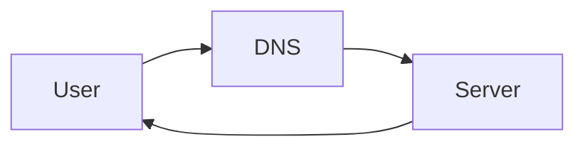
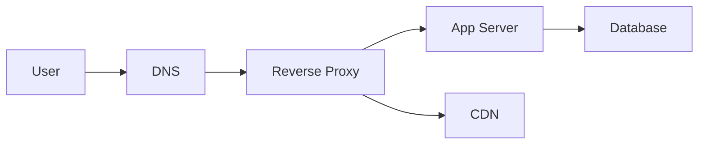
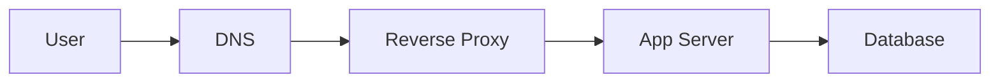
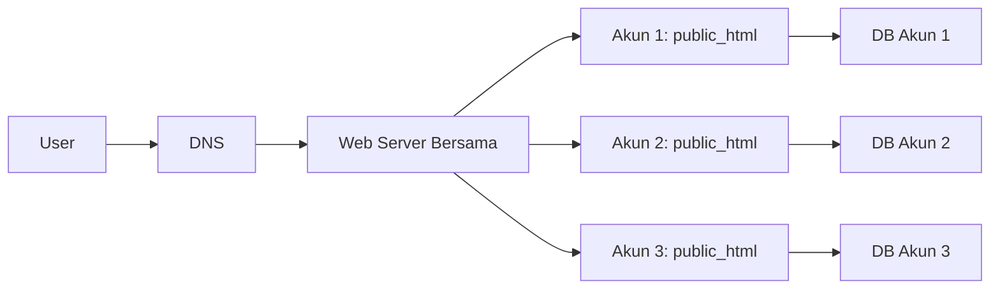

# Buku Praktis: Hosting Web (Fokus VPS) untuk Pemula

## Tentang Buku Ini
Buku ini adalah panduan langkah demi langkah untuk memahami hosting web dari nol. Anda akan belajar istilah penting, tipe hosting, arsitektur dasar website, hingga studi kasus lengkap: men-deploy aplikasi PHP ke VPS.

## Tujuan Akhir
Setelah menyelesaikan buku ini, Anda mampu:
- Menjelaskan apa itu hosting dan mengapa dibutuhkan.
- Memahami istilah kunci seperti domain, DNS, IP, HTTP/HTTPS, SSL.
- Memilih jenis hosting yang tepat untuk kebutuhan tertentu.
- Memahami arsitektur hosting (reverse proxy, app server, database).
- Mengetahui perbedaan hosting frontend dan backend.
- Melakukan deployment sederhana aplikasi PHP ke VPS.

## Prasyarat Minimum
- Laptop/PC.
- Koneksi internet.
- Mampu menggunakan terminal dasar.

---

# Bab 1. Apa Itu Hosting

## 1.1 Definisi Hosting
Hosting adalah layanan untuk menempatkan website/aplikasi agar bisa diakses publik melalui internet. Secara sederhana: menyewa komputer server yang aktif 24/7.

## 1.2 Mengapa Hosting Dibutuhkan
- Website bisa diakses kapan saja.
- Ada alamat konsisten melalui domain.
- Resource (CPU, RAM, storage) tersedia.
- Mendukung kolaborasi dan deployment.

## Ringkasan Bab 1
Hosting adalah fondasi agar website Anda bisa diakses publik dan berjalan stabil.

## Latihan Bab 1
1. Tuliskan 3 alasan mengapa website perlu hosting.

---

# Bab 2. Istilah Dasar Hosting dan Jaringan

## 2.1 Server
Komputer yang menerima request dan mengirimkan response.

## 2.2 Domain
Nama yang mudah diingat, misal `contoh.com`.

## 2.3 DNS
Sistem yang menerjemahkan domain ke IP server.

## 2.4 IP Address
Alamat numerik server, contoh: `203.0.113.10`.

## 2.5 HTTP/HTTPS
Protokol komunikasi web. HTTPS menggunakan enkripsi.

## 2.6 SSL/TLS
Teknologi enkripsi yang membuat HTTPS aman.

## 2.7 Bandwidth, Latency, Uptime
- **Bandwidth**: kapasitas transfer data.
- **Latency**: waktu tunda respons.
- **Uptime**: persentase server aktif.

## Ilustrasi Alur Dasar


## Ringkasan Bab 2
Istilah dasar ini adalah fondasi sebelum memilih jenis hosting.

## Latihan Bab 2
1. Jelaskan perbedaan domain dan DNS.
2. Apa beda HTTP dan HTTPS?

---

# Bab 3. Jenis Hosting

## 3.1 Shared Hosting
- Banyak website di satu server.
- Murah, cocok untuk website kecil.
- Kontrol terbatas.

## 3.2 VPS (Virtual Private Server)
- Satu server fisik dibagi menjadi beberapa server virtual.
- Lebih fleksibel dan punya kontrol penuh.
- Cocok untuk web app yang berkembang.

## 3.3 Shared Hosting Lebih Detail (Cara Kerja dan cPanel)
### Cara Kerja Shared Hosting
- Banyak website berada di satu server fisik yang sama.
- Resource (CPU, RAM, storage) dibagi bersama.
- Provider biasanya mengelola keamanan dasar dan update server.

### Kenapa Banyak Dipakai Pemula
- Biaya murah.
- Setup cepat.
- Tidak perlu mengelola server secara teknis.

### cPanel (Gambaran Umum)
cPanel adalah panel kontrol untuk mengelola hosting shared. Umumnya Anda akan melakukan hal berikut:
1. Login ke cPanel dari link yang diberikan provider.
2. Mengelola file dengan **File Manager** atau FTP.
3. Mengatur database lewat **MySQL Databases**.
4. Mengelola domain/subdomain di menu **Domains**.
5. Mengaktifkan SSL di menu **SSL/TLS**.
6. Mengatur email hosting di menu **Email Accounts**.
7. Melihat penggunaan resource di menu **Metrics**.

Catatan: Istilah menu bisa sedikit berbeda antar provider, tapi konsepnya sama.

## 3.4 PaaS vs IaaS
- **IaaS**: Anda mengelola server sendiri (VPS termasuk IaaS).
- **PaaS**: platform siap pakai, fokus deploy tanpa mengelola server.

## Ringkasan Bab 3
Jika butuh kontrol dan fleksibilitas, VPS adalah pilihan yang umum.

## Latihan Bab 3
1. Sebutkan kelebihan VPS dibanding shared hosting.

---

# Bab 4. Hosting “Biologi” (Arsitektur Dasar)

## 4.1 Komponen Utama
- **Reverse Proxy**: menerima request dan meneruskan ke app (contoh: Nginx).
- **App Server**: menjalankan aplikasi (PHP, Node.js, dll).
- **Database**: menyimpan data (MySQL/PostgreSQL).
- **Storage**: file statis (gambar, dokumen).
- **CDN** (opsional): mempercepat akses file statis.

### Hosting Biology untuk Shared Hosting
Pada shared hosting, komponen-komponen di atas biasanya sudah disiapkan oleh provider, dengan pola berikut:
- **Satu server, banyak akun**: tiap akun punya folder sendiri (sering disebut `public_html`).
- **Web server bersama**: Apache/Nginx melayani banyak domain sekaligus.
- **Database bersama (terpisah logis)**: setiap akun membuat database dan user sendiri di satu mesin MySQL.
- **Control panel**: cPanel/DirectAdmin untuk mengelola file, domain, database, dan SSL.
- **Isolasi sederhana**: pemisahan akses berbasis user agar akun tidak saling melihat.

Implikasi:
- Anda tidak mengelola OS atau web server secara penuh.
- Cocok untuk website kecil, tetapi kurang fleksibel untuk aplikasi kompleks.

## 4.2 Alur Request


## 4.3 Diagram: App + DB di Balik Reverse Proxy


## 4.4 Diagram: Shared Hosting (Multi-tenant)


## Ringkasan Bab 4
Website modern adalah kombinasi beberapa komponen, bukan hanya satu server.

## Latihan Bab 4
1. Jelaskan peran reverse proxy dengan kata-kata sendiri.

---

# Bab 5. Frontend Hosting vs Backend Hosting

## 5.1 Frontend Hosting
- Menyajikan file statis (HTML, CSS, JS).
- Fokus pada kecepatan dan caching.
- Contoh: hosting di CDN atau static hosting.

## 5.2 Backend Hosting
- Menjalankan logika aplikasi (API, auth, database).
- Fokus pada stabilitas dan keamanan.

## 5.3 Hosting AI App: Dua Skenario Umum
Hosting aplikasi AI punya kebutuhan berbeda dari aplikasi biasa, terutama pada **biaya komputasi, latency, dan keamanan data**. Berikut dua skenario paling umum:

### Skenario A: AI API Wrapper (Menggunakan API Provider)
Contoh: aplikasi Anda memanggil API dari penyedia AI (misal LLM) lalu menampilkan hasil.

**Ciri khas:**
- Komputasi model terjadi di pihak provider.
- Anda hanya butuh server untuk menerima request dan meneruskan ke API.
- Tidak perlu GPU di server Anda.

**Tips penting:**
- Simpan API key di **environment variable** (jangan di repo).
- Gunakan **rate limiting** agar biaya tidak membengkak.
- Tambahkan **retry** dan **timeout** untuk menjaga kestabilan.
- Gunakan **cache** jika banyak request berulang.
- Catat penggunaan untuk mengontrol biaya.

### Skenario B: Inference Engine (Model Dijalankan Sendiri)
Contoh: Anda menjalankan model AI di server sendiri (self-hosted).

**Ciri khas:**
- Butuh resource besar (CPU/GPU, RAM, storage).
- Waktu respon bisa lebih lama jika model besar.
- Perlu manajemen model (download, update, versioning).

**Tips penting:**
- Pilih server dengan **GPU** jika model besar.
- Gunakan **batching** untuk menghemat biaya per request.
- Sediakan **queue** untuk request yang berat.
- Gunakan **reverse proxy** dan **load balancer** jika traffic tinggi.
- Simpan model di storage lokal agar lebih cepat saat start.

### Perbedaan Utama dengan Aplikasi Biasa
- **Resource**: AI membutuhkan CPU/GPU dan RAM lebih besar.
- **Biaya**: bisa melonjak jika tidak dikontrol.
- **Latency**: response cenderung lebih lambat.
- **Keamanan**: data input/output harus dijaga karena sering sensitif.

## Ringkasan Bab 5
Frontend bisa di-host terpisah dari backend sesuai kebutuhan skala.

## Latihan Bab 5
1. Berikan contoh aplikasi yang membutuhkan backend hosting.

---

# Bab 6. Studi Kasus Lengkap: Hosting Aplikasi PHP ke VPS

## 6.1 Gambaran Kasus
Anda punya aplikasi PHP sederhana (misalnya website UMKM). Target: deploy ke VPS Ubuntu menggunakan Nginx + PHP-FPM + MySQL.

## 6.2 Persiapan
Yang dibutuhkan:
- VPS aktif (Ubuntu 22.04 misalnya).
- Domain (opsional, bisa pakai IP dulu).
- Akses SSH ke VPS.

## 6.3 Login ke VPS
```
ssh user@IP_SERVER
```

## 6.4 Update Server
```
sudo apt update && sudo apt upgrade -y
```

## 6.5 Install Nginx, PHP, dan MySQL
```
sudo apt install -y nginx
sudo apt install -y php-fpm php-mysql
sudo apt install -y mysql-server
```

## 6.6 Buat Folder Project
```
sudo mkdir -p /var/www/umkm-app
sudo chown -R $USER:$USER /var/www/umkm-app
```

## 6.7 Upload Aplikasi PHP
Misal struktur sederhana:
```
/var/www/umkm-app
  index.php
  assets/
```
Isi `index.php` contoh:
```php
<?php
  echo "Halo dari VPS!";
?>
```

## 6.8 Konfigurasi Nginx
Buat file konfigurasi:
```
sudo nano /etc/nginx/sites-available/umkm-app
```
Isi:
```
server {
  listen 80;
  server_name contoh.com;

  root /var/www/umkm-app;
  index index.php index.html;

  location / {
    try_files $uri $uri/ /index.php?$query_string;
  }

  location ~ \.php$ {
    include snippets/fastcgi-php.conf;
    fastcgi_pass unix:/var/run/php/php8.1-fpm.sock;
  }
}
```
Aktifkan:
```
sudo ln -s /etc/nginx/sites-available/umkm-app /etc/nginx/sites-enabled/
sudo nginx -t
sudo systemctl reload nginx
```

## 6.9 Setup Database (Jika Perlu)
```
sudo mysql
CREATE DATABASE umkm_db;
CREATE USER 'umkm_user'@'localhost' IDENTIFIED BY 'passwordku';
GRANT ALL PRIVILEGES ON umkm_db.* TO 'umkm_user'@'localhost';
FLUSH PRIVILEGES;
EXIT;
```

## 6.10 Hubungkan Aplikasi ke DB
Di file konfigurasi PHP (misal `.env` atau `config.php`), isi:
```
DB_HOST=localhost
DB_NAME=umkm_db
DB_USER=umkm_user
DB_PASS=passwordku
```

## 6.11 Uji Akses
Buka browser:
- `http://IP_SERVER`
- atau `http://contoh.com`

Jika tampil “Halo dari VPS!”, berarti deploy berhasil.

## 6.12 (Opsional) Pasang SSL dengan Let’s Encrypt
```
sudo apt install -y certbot python3-certbot-nginx
sudo certbot --nginx -d contoh.com
```

## Ringkasan Bab 6
Aplikasi PHP di VPS membutuhkan server web, PHP runtime, dan database. Konfigurasi Nginx adalah kunci agar aplikasi berjalan.

## Latihan Bab 6
1. Coba deploy aplikasi PHP sederhana ke VPS.
2. Ubah `index.php` dan cek perubahan di browser.

---

# Bab 7. Checklist Akhir

## 7.1 Checklist Kompetensi
1. Saya memahami konsep hosting.
2. Saya paham istilah jaringan dasar.
3. Saya bisa memilih hosting yang sesuai.
4. Saya tahu komponen utama arsitektur web.
5. Saya bisa deploy aplikasi PHP sederhana ke VPS.

## 7.2 Jika Masih Kesulitan
- Ulangi bab yang terkait.
- Lakukan latihan lagi dengan proyek kecil.

---

# Referensi
- https://nginx.org/en/
- https://www.php.net/manual/en/
- https://dev.mysql.com/doc/
- https://certbot.eff.org/
- https://www.cloudflare.com/learning/
